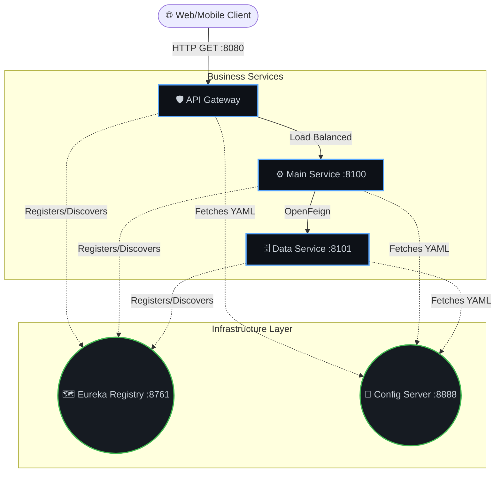
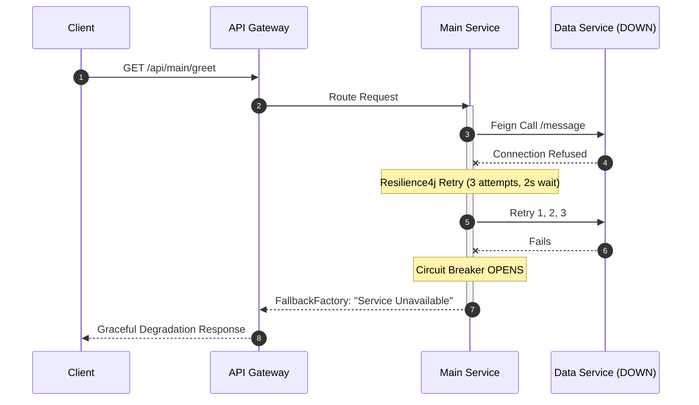
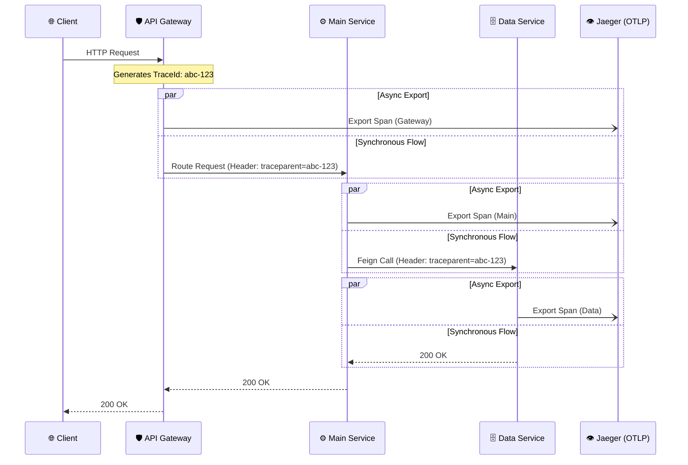
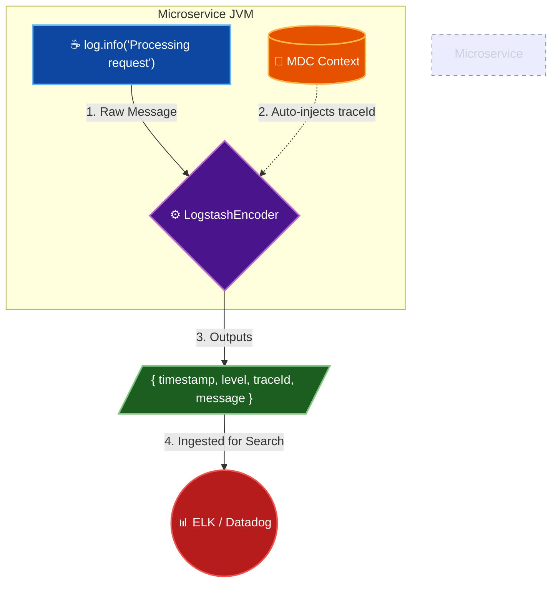
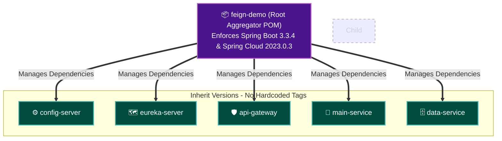
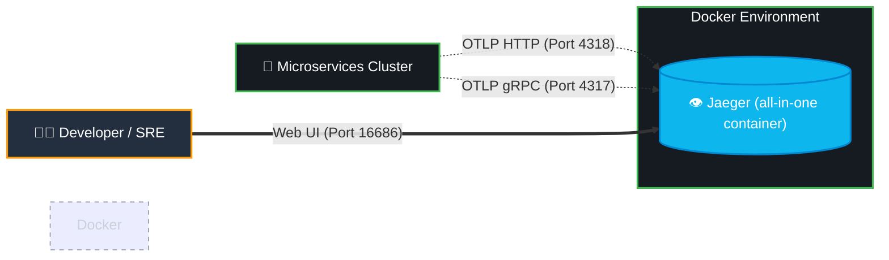
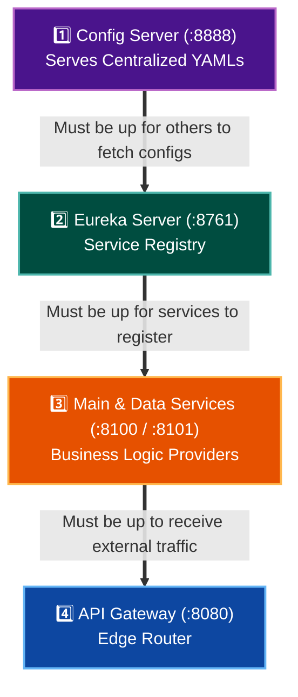
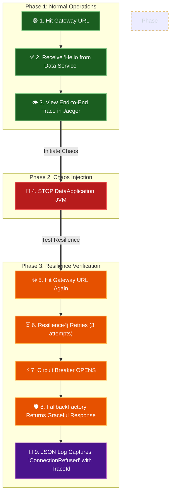

# Enterprise Spring Cloud Microservices Architecture

[](https://spring.io/projects/spring-boot)
[](https://www.oracle.com/java/)
[](https://opentelemetry.io/)

A production-ready, fault-tolerant microservices cluster demonstrating modern cloud-native patterns. Built to showcase strict separation of concerns, centralized configuration, edge routing, and deep observability.

## 🏗️ Architectural Blueprint



This project implements a 5-node distributed system using the **API Gateway Pattern** and **Client-Side Load Balancing**.

*   **`api-gateway` (Port 8080):** The single entry point. Routes external traffic to internal services using Spring Cloud Gateway and Eureka path predicates.
*   **`main-service` (Port 8100):** The primary consumer. Orchestrates business logic and communicates with downstream services via OpenFeign.
*   **`data-service` (Port 8101):** The backend provider exposing core data endpoints.
*   **`config-server` (Port 8888):** Centralized configuration manager serving environment-specific YAML rules to all nodes.
*   **`eureka-server` (Port 8761):** Service registry enabling dynamic discovery and eliminating hardcoded IPs.

## 🚀 Key Enterprise Patterns Implemented

### 1. Fault Tolerance & Resilience (Resilience4j)

*   **Circuit Breaker:** Protects `main-service` from cascading failures. If `data-service` fails, the circuit opens (50% threshold) to instantly reject requests and save Tomcat threads.
*   **Retry Mechanism:** Automatically retries transient network failures (3 attempts, 2s backoff) before opening the circuit.
*   **Fallback Factory:** Implements the OpenFeign `FallbackFactory` pattern to gracefully degrade service while capturing and logging the exact `Throwable` cause for monitoring.

### 2. Deep Observability (OpenTelemetry + Jaeger)

*   **Distributed Tracing:** Utilizes Micrometer and OpenTelemetry (OTLP) to inject a unique `traceId` at the Gateway, propagating it across all JVM boundaries via HTTP headers (`feign-micrometer`).
*   **Visual Waterfall:** Traces are exported to a Jaeger backend, allowing millisecond-level latency analysis across the network hops.

### 3. Structured JSON Logging

*   **Machine-Readable Logs:** Replaced standard console text with `logstash-logback-encoder`.
*   **MDC Context Injection:** The `traceId` and `spanId` are automatically injected into the JSON log payload, allowing log aggregators (ELK/Datadog) to instantly correlate logs to specific user requests.

### 4. Strict Maven Multi-Module Design

*   **Dependency Management:** Utilizes a Root Aggregator POM to enforce strict version control (Spring Boot 3.3.4, Spring Cloud 2023.0.3) across all child modules, eliminating dependency hell and classpath collisions.

## 🛠️ Local Setup & Chaos Testing

### Prerequisites
*   Java 17+
*   Maven 3.8+
*   Docker (for Jaeger)

### 1. Start the Observability Backend
```bash
docker run -d -p 16686:16686 -p 4317:4317 -p 4318:4318 jaegertracing/all-in-one:latest
```



### 2. Boot the Cluster (Strict Order)
1. `ConfigServerApplication`
2. `EurekaServerApplication`
3. `DataApplication` & `MainApplication`
4. `ApiGatewayApplication`



### 3. Execute the Chaos Test
1. **The Happy Path:** Navigate to `http://localhost:8080/api/main/greetUsingFeignClient`. You will receive a successful response from the Data Service.
2. **View the Trace:** Open Jaeger at `http://localhost:16686` to view the end-to-end trace propagation.
3. **Simulate Outage:** Stop the `DataApplication` JVM.
4. **Verify Circuit Breaker:** Hit the Gateway URL again. Observe the Resilience4j Retry mechanism wait, followed by the graceful Fallback Factory response. Check the JSON logs to see the captured `ConnectionRefused` exception tied to the exact `traceId`.

